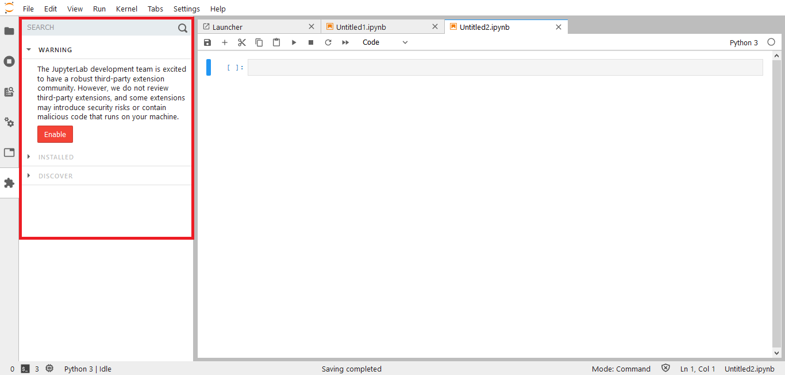
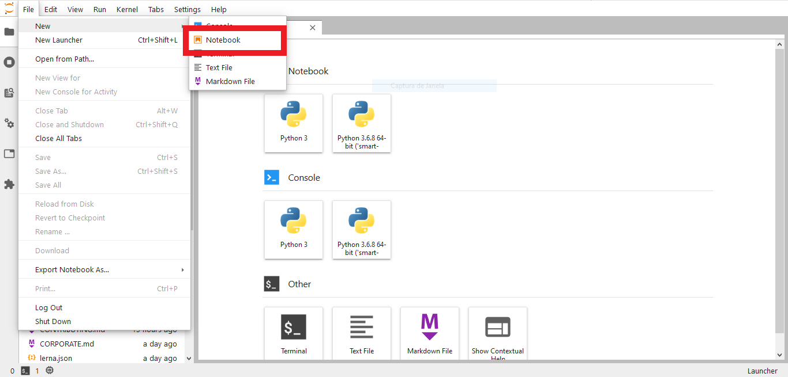
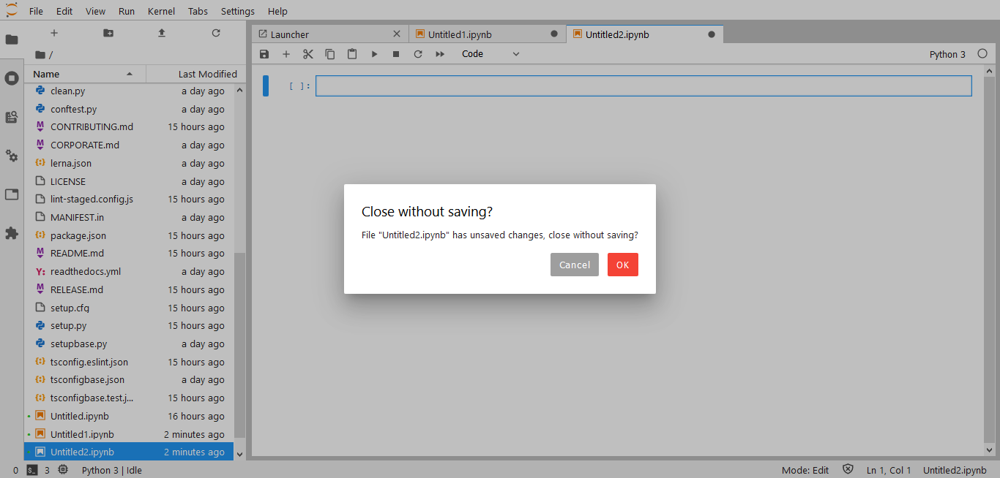
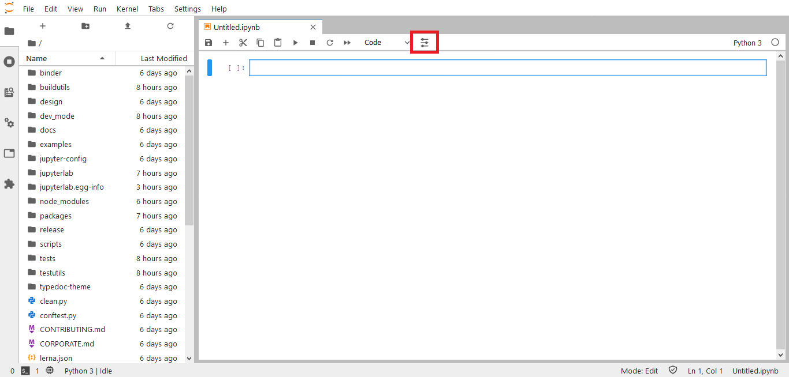
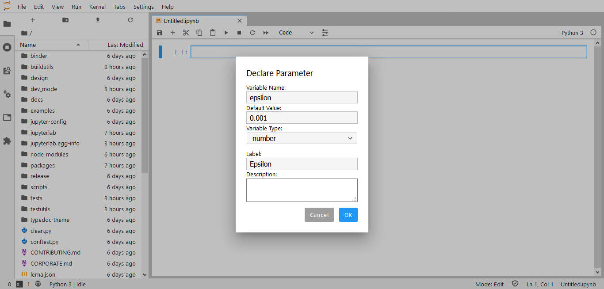

author:            Fabio Beranizo Lopes
summary:           JupyterLab Extension Development
id:                jupyterlab-extension-development
categories:        cloud
status:            draft
feedback link:     github.com/fberanizo/jupyterlab-tutorial

# JupyterLab Extension Development

## Visão Geral
Duration: 0:03:00

[Project Jupyter](https://jupyter.org/) trabalha para construir padrões, serviços e interfaces para diversas linguagens de programação. Uma de suas aplicações mais importantes é a interface web [JupyterLab](https://jupyterlab.readthedocs.io/en/stable/). Tão importante que é usado em plataformas como o [AWS SageMaker Studio](https://docs.aws.amazon.com/sagemaker/latest/dg/gs-studio-end-to-end.html#studio-tour-notebooks) e o [Google Colaboratory](https://colab.research.google.com/notebooks/basic_features_overview.ipynb).

### O Que Você Vai Aprender

* Noções básicas sobre o Jupyter Notebook
* Como criar um ambiente de desenvolvimento para o JupyterLab
* Como criar extensões usando npm e TypeScript
* Como instalar e usar as extensões criadas

## Introdução ao Jupyter Notebook
Duration: 0:03:00

Os principais conceitos que envolvem o JupyterLab são descritos a seguir:

### Kernels

Kernel é o programa que roda o código do notebook. O Kernel Python é o principal, porém kernels de [outras linguagens](https://github.com/jupyter/jupyter/wiki/Jupyter-kernels) podem ser instalados.

**Cada notebook tem sua própria memória e seu próprio kernel.**

Use o menu `Kernel` para reiniciar ou trocar a linguagem de programação do kernel para o notebook visualizado.

### JupyterLab Workspaces

Workspaces mantém o estado do JupyterLab: abas abertas e layout. Quando a página é recarregada o estado do workspace é recuperado.

O workspace padrão é acessado diretamente na URL /lab:<br>
`http(s)://<server:port>/<lab-location>/lab`

Outros workspaces têm o nome na URL:<br>
`http(s)://<server:port>/<lab-location>/lab/workspaces/foo`

**Workspaces salvam o estado no backend e podem ser compartilhados por usuários (ou browsers).**

### JupyterLab Extensions

Extensões podem alterar ou adicionar qualquer parte do JupyterLab. Por exemplo, é possível:

- Criar novos temas e estilos (eg. [horizon-theme](https://github.com/mohirio/jupyterlab-horizon-theme))
- Adicionar visualizadores/editores de arquivo
- Criar renderizadores em células de notebooks (eg. [tensorboard](https://github.com/chaoleili/jupyterlab_tensorboard))
- Adicionar [itens em menus e barra de ferramentas](https://jupyterlab.readthedocs.io/en/stable/user/interface.html#menu-bar)
- Adicionar [atalhos de teclados](https://jupyterlab.readthedocs.io/en/stable/user/interface.html#keyboard-shortcuts)

Extensões são `npm packages` (projetos Javascript).

[De fato, todo o JupyterLab é uma coleção de extensões...](https://github.com/jupyterlab/jupyterlab/tree/master/packages)

## Ambiente de desenvolvimento
Duration: 0:10:00

Será necessário [NodeJS](https://nodejs.org/en/) e [Python>=3.6](https://www.python.org/downloads/).<br>
Instale também o Python package [cookiecutter](https://github.com/cookiecutter/cookiecutter#cookiecutter) para criar seus projetos mais rapidamente.<br>
O uso de [virtualenv](https://virtualenv.pypa.io/en/latest/installation.html#via-pip) ou [virtualenvwrapper](https://virtualenvwrapper.readthedocs.io/en/latest/install.html#basic-installation) é aconselhado.

Execute os seguintes comandos:

```bash
# Fazer download do projeto
git clone https://github.com/jupyterlab/jupyterlab/
# Instalar dependências
pip install -e .
jlpm install
# Construir artefatos
jupyter lab build
# Iniciar JupyterLab em http://localhost:8888/lab
jupyter lab --NotebookApp.token='' --NotebookApp.password=''
```

Abra o browser em [http://localhost:8888/lab](http://localhost:8888/lab)

**Pronto! Você já tem tudo o que é necessário para criar suas extensões.**

## Criar uma extensão em TypeScript
Duration: 0:15:00

O exemplo a seguir mostra como construir uma extensão simples. Quando a *query string* `?open=notebook` existir (eg. `http://localhost:8888/lab/tree/path/to/folder/?open=notebook` todos os notebooks na pasta serão abertos.

### Estrutura do projeto

**Na pasta `jupyterlab/packages/`, crie o projeto usando `cookiecutter https://github.com/jupyterlab/extension-cookiecutter-ts`**

```
author_name []: Your Name
extension_name [myextension]: url-functions-extension
project_short_description [A JupyterLab extension.]: A JupyterLab extension that creates some URL functions
has_server_extension [n]: n
repository [https://github.com/my_name/myextension]: https://github.com/my_name/url-functions-extension
```

**A seguinte estrutura será gerada:**

    jupyterlab
    ├─ ...
    └ packages
       ├─ ...
       ├── url-functions-extension
       │   ├── LICENSE
       │   ├── README.md
       │   ├── package.json   <- npm package definition
       │   ├── src
       │   │   └── index.ts   <- TypeScript source
       │   ├── style
       │   │   └── index.css  <- Stylesheet source
       │   └── tsconfig.json  <- TypeScript package definition
       └ ...

**Na pasta `jupyterlab/packages/url-functions-extension/`, adicione as dependências do projeto:**

```bash
cd ./packages/url-functions-extension/
jlpm add @jupyterlab/application
jlpm add @jupyterlab/apputils
jlpm add @jupyterlab/services
```

Crie/Edite os seguintes arquivos (os trechos sem alteração serão omitidos):

#### **`src/index.ts`**
```ts
import {
  IRouter,
  JupyterFrontEnd,
  JupyterFrontEndPlugin
} from '@jupyterlab/application';

import { ICommandPalette } from '@jupyterlab/apputils';

import { Contents } from '@jupyterlab/services';

/**
 * The command IDs used by the url-functions plugin.
 */
namespace CommandIDs {
  export const open = 'url-functions:open';
}

/**
 * Initialization data for the url-functions extension.
 */
const extension: JupyterFrontEndPlugin<void> = {
  id: 'url-functions-extension',
  autoStart: true,
  requires: [JupyterFrontEnd.IPaths, ICommandPalette, IRouter],
  activate: (
    app: JupyterFrontEnd,
    paths: JupyterFrontEnd.IPaths,
    palette: ICommandPalette,
    router: IRouter
  ) => {
    console.log('JupyterLab extension url-functions-extension is activated!');

    app.commands.addCommand(CommandIDs.open, {
      label: 'Open all notebooks...',
      execute: async () => {
        const args = router.current;
        // gets url path, then removes prefixes: `/lab/workspaces/foo`, `/lab`, `/tree`
        const dirpath = args.path
          .replace(new RegExp(`^${paths.urls.workspaces}\/([^?\/]+)`), '')
          .replace(new RegExp(`^${paths.urls.app}`), '')
          .replace(new RegExp('^/tree'), '');

        // fetch the contents of dirpath
        const item = await app.serviceManager.contents.get(dirpath);

        if (item.type === 'directory') {
          // filter by notebooks
          const notebooks = item.content.filter(
            (i: Contents.IModel) => i.type === 'notebook'
          );

          // open notebooks
          notebooks.forEach(({ path }: Contents.IModel) => {
            void app.commands.execute('docmanager:open', { path });
          });

          const url = args.path + args.hash;
          router.navigate(url);
        }
      }
    });

    palette.addItem({
      command: CommandIDs.open,
      category: 'File Operations',
      args: {}
    });

    router.register({
      command: CommandIDs.open,
      pattern: /(\?open=notebook|\&open=notebook)($|&)/,
      rank: 10 // High priority: 10:100.
    });
  }
};

export default extension;
```

### Construir extensão

**Na pasta `jupyterlab/packages/url-functions-extension/` execute os seguintes comandos:**

```bash
# Install dependencies
jlpm
# Build Typescript source
jlpm build
# Link your development version of the extension with JupyterLab
jupyter labextension link .
# Rebuild Typescript source after making changes
jlpm build
# Rebuild JupyterLab after making any changes
jupyter lab build
```

**Na pasta `jupyterlab/` execute os seguintes comandos:**

```bash
# Watch the source directory in another terminal tab
jlpm watch
# Run jupyterlab in watch mode in one terminal tab
jupyter lab --watch --NotebookApp.token='' --NotebookApp.password=''
```

### Testar extensão no JupyterLab

Abra o browser em [http://localhost:8888/lab](http://localhost:8888/lab)

1. Clique na aba "Extension Manager" no painel à esquerda. Habilite as extensões se necessário.


2. Crie alguns notebooks.


3. Feche todas as abas.


4. Acesse a URL com `http://localhost:8888/lab?open=notebook` e veja se os arquivos são abertos.
<!--  -->

**Parabéns! Você criou a sua primeira extensão!**

## Adicionar Item à Barra de Ferramentas e Modal (Dialog)
Duration: 0:15:00

O exemplo a seguir mostra como construir uma extensão que adiciona elementos à interface web do JupyterLab. Um botão será adicionado à barra de ferramentas, e ao clicá-lo um modal exibirá os campos para declarar um parâmetro no código.<br>
Parâmetros são variáveis seguidas por um comentário no formato do [Google Colaboratory Forms](https://colab.research.google.com/notebooks/forms.ipynb).

Exemplos:

1. `text = 'value' #@param {type:"string"}`

2. `dropdown = '1st option' #@param ["1st option", "2nd option", "3rd option"]`

### Estrutura do projeto

**Na pasta `jupyterlab/packages/`, crie o projeto usando `cookiecutter https://github.com/jupyterlab/extension-cookiecutter-ts`**

```
author_name []: Your Name
extension_name [myextension]: parameters-extension
project_short_description [A JupyterLab extension.]: A JupyterLab extension that allows to parameterize code
has_server_extension [n]: n
repository [https://github.com/my_name/myextension]: https://github.com/my_name/parameters-extension
```

**A seguinte estrutura será gerada:**

    jupyterlab
    ├─ ...
    └ packages
       │   ├── LICENSE
       │   ├── README.md
       │   ├── package.json   <- npm package definition
       │   ├── src
       │   │   └── index.ts   <- TypeScript source
       │   ├── style
       │   │   └── index.css  <- Stylesheet source
       │   └── tsconfig.json  <- TypeScript package definition
       └ ...

**Na pasta `jupyterlab/packages/parameters-extension/`, adicione as dependências do projeto:**

```bash
cd ./packages/parameters-extension/
jlpm add @jupyterlab/application
jlpm add @jupyterlab/apputils
jlpm add @jupyterlab/docregistry
jlpm add @jupyterlab/notebook
jlpm add @jupyterlab/ui-components
jlpm add @lumino/disposable
jlpm add @lumino/widgets
```

Crie/Edite os seguintes arquivos (os trechos sem alteração serão omitidos):

#### **`src/svg.d.ts`**
```ts
declare module '*.svg' {
  const value: string;
  export default value;
}
```

#### **`style/icons/sliders.svg`**
```xml
<svg xmlns="http://www.w3.org/2000/svg" width="20pt" height="32" viewBox="0 0 20 24">
    <g  class="jp-icon3" fill="#231f20">
        <path d="M19 10.816h-.86c-.456-1.312-1.69-2.254-3.14-2.254-1.45 0-2.684.942-3.14 2.254H1c-.55 0-1 .454-1 1.016 0 .559.45 1.012 1 1.012h10.79c.39 1.43 1.679 2.48 3.21 2.48s2.82-1.05 3.21-2.48H19c.55 0 1-.453 1-1.012 0-.562-.45-1.016-1-1.016zm0 0M19 19.605H8.14c-.456-1.312-1.69-2.253-3.14-2.253-1.45 0-2.684.941-3.14 2.253H1c-.55 0-1 .454-1 1.016 0 .559.45 1.012 1 1.012h.79c.39 1.43 1.679 2.48 3.21 2.48s2.82-1.05 3.21-2.48H19c.55 0 1-.453 1-1.012 0-.562-.45-1.016-1-1.016zm0 0M1 4.395h.79c.39 1.43 1.679 2.48 3.21 2.48s2.82-1.05 3.21-2.48H19c.55 0 1-.454 1-1.016 0-.559-.45-1.012-1-1.012H8.14C7.685 1.055 6.45.113 5 .113c-1.45 0-2.684.942-3.14 2.254H1c-.55 0-1 .453-1 1.012 0 .562.45 1.016 1 1.016zm0 0"/>
    </g>
</svg>
```

#### **`tsconfig.json`**
```json
{
  ...
  "files": ["src/svg.d.ts"],
  ...
}
```

#### **`src/index.ts`**
```ts
import { IDisposable, DisposableDelegate } from '@lumino/disposable';

import { Widget } from '@lumino/widgets';

import {
  JupyterFrontEnd,
  JupyterFrontEndPlugin
} from '@jupyterlab/application';

import { showDialog, Dialog, ToolbarButton } from '@jupyterlab/apputils';

import { DocumentRegistry } from '@jupyterlab/docregistry';

import { NotebookPanel, INotebookModel } from '@jupyterlab/notebook';

import { LabIcon } from '@jupyterlab/ui-components';

import slidersSvgstr from '../style/icons/sliders.svg';

/**
 * Initialization data for the parameters-extension extension.
 */
const extension: JupyterFrontEndPlugin<void> = {
  id: 'parameters-extension',
  autoStart: true,
  activate
};

export default extension;

/**
 * Activate the extension.
 */
function activate(app: JupyterFrontEnd) {
  console.log('JupyterLab extension parameters-extension is activated!');

  // Add Button to Toolbar
  app.docRegistry.addWidgetExtension('Notebook', new ButtonExtension());
}

/**
 * A notebook widget extension that adds a button to the toolbar.
 */
export class ButtonExtension
  implements DocumentRegistry.IWidgetExtension<NotebookPanel, INotebookModel> {
  createNew(
    panel: NotebookPanel,
    context: DocumentRegistry.IContext<INotebookModel>
  ): IDisposable {
    const button = new ToolbarButton({
      icon: slidersIcon,
      onClick: () => {
        void showDialog({
          title: 'Declare Parameter',
          body: new Widget({ node: createForm() }),
          buttons: [Dialog.cancelButton(), Dialog.okButton()]
        });
      },
      tooltip: 'Declare Parameter'
    });

    panel.toolbar.insertAfter('cellType', 'declareParameter', button);
    return new DisposableDelegate(() => {
      button.dispose();
    });
  }
}

function createForm() {
  const body = document.createElement('div');

  // Name Input
  const nameTitle = document.createElement('label');
  nameTitle.textContent = 'Variable Name:';
  const name = document.createElement('input');
  body.appendChild(nameTitle);
  body.appendChild(name);

  // Default Value Input
  const defaultValueTitle = document.createElement('label');
  defaultValueTitle.textContent = 'Default Value:';
  const defaultValue = document.createElement('input');
  body.appendChild(defaultValueTitle);
  body.appendChild(defaultValue);

  // Type Select
  const typeTitle = document.createElement('label');
  typeTitle.textContent = 'Variable Type:';
  const type = document.createElement('select');
  const options = ['string', 'integer', 'number'];
  options.forEach(item => {
    const option = document.createElement('option');
    option.value = item;
    option.textContent = item;
    type.appendChild(option);
  });
  body.appendChild(typeTitle);
  body.appendChild(type);

  // Label Input
  const labelTitle = document.createElement('label');
  labelTitle.textContent = 'Label:';
  const label = document.createElement('input');
  body.appendChild(labelTitle);
  body.appendChild(label);

  // Description Input
  const descriptionTitle = document.createElement('label');
  descriptionTitle.textContent = 'Description:';
  const description = document.createElement('textarea');
  body.appendChild(descriptionTitle);
  body.appendChild(description);

  return body;
}

export const slidersIcon = new LabIcon({
  name: 'parameters:sliders',
  svgstr: slidersSvgstr
});
```

### Construir extensão

**Na pasta `jupyterlab/packages/parameters-extension/`, execute os seguintes comandos:**

```bash
# Install dependencies
jlpm
# Build Typescript source
jlpm build
# Link your development version of the extension with JupyterLab
jupyter labextension link .
# Rebuild Typescript source after making changes
jlpm build
# Rebuild JupyterLab after making any changes
jupyter lab build
```

**Na pasta `jupyterlab/` execute os seguintes comandos:**

```bash
# Watch the source directory in another terminal tab
jlpm watch
# Run jupyterlab in watch mode in one terminal tab
jupyter lab --watch --NotebookApp.token='' --NotebookApp.password=''
```

### Testar extensão no JupyterLab

Abra o browser em [http://localhost:8888/lab](http://localhost:8888/lab)

1. Clique no ícone "Parameters" na barra de ferramentas


2. Preencha os campos solicitados


3. Veja se o código contém o parâmetro declarado no passo anterior.

**Parabéns! Agora você sabe como criar elementos visuais usando extensões!**

## JupyterLab no PlatIAgro

### E agora?

Acesse o fork do JupyterLab no repo do PlatIAgro:

- [github.com/platiagro/jupyterlab](https://github.com/platiagro/jupyterlab/)

Desenvolva alguma destas funcionalidades:

- [Declarar parâmetros das tarefas/componentes no JupyterLab](https://jira.cpqd.com.br/browse/PLATIA-579)
- [Criar células com trechos de código úteis do PlatIAgro SDK no JupyterLab](https://jira.cpqd.com.br/browse/PLATIA-580)
- [Upload de .CSV e .TXT, criação de datasets, e edição do parâmetro dataset no JupyterLab](https://jira.cpqd.com.br/browse/PLATIA-581)

### Leitura adicional

- [Extension Developer Guide](https://jupyterlab.readthedocs.io/en/stable/developer/extension_dev.html#)
- [Common Extension Points](https://jupyterlab.readthedocs.io/en/stable/developer/extension_points.html)
- [Contributing to JupyterLab](https://github.com/jupyterlab/jupyterlab/blob/master/CONTRIBUTING.md)
- [How to extend the Notebook plugin](https://jupyterlab.readthedocs.io/en/stable/developer/notebook.html#how-to-extend-the-notebook-plugin)
- [Let’s Make an Astronomy Picture of the Day JupyterLab Extension](https://jupyterlab.readthedocs.io/en/stable/developer/extension_tutorial.html)
